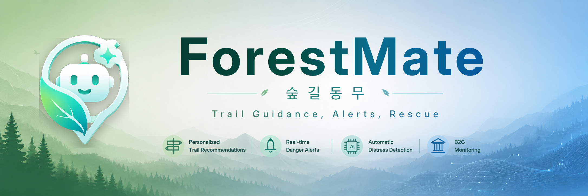
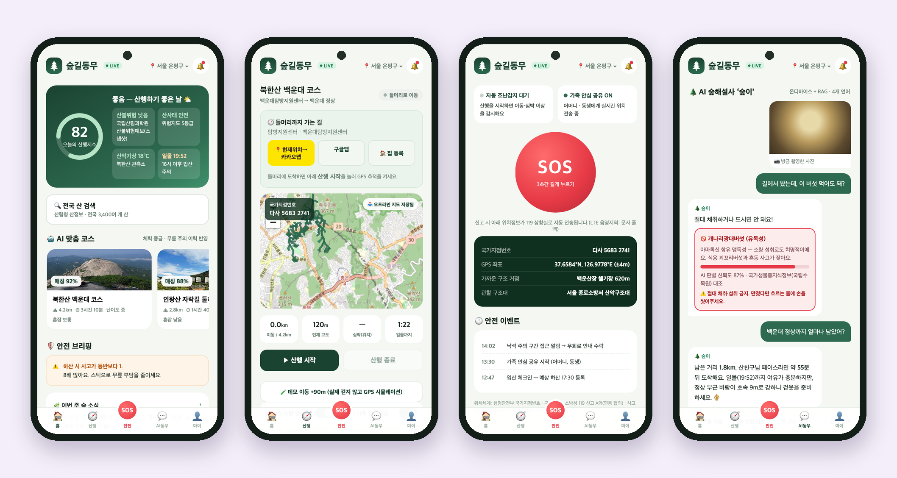
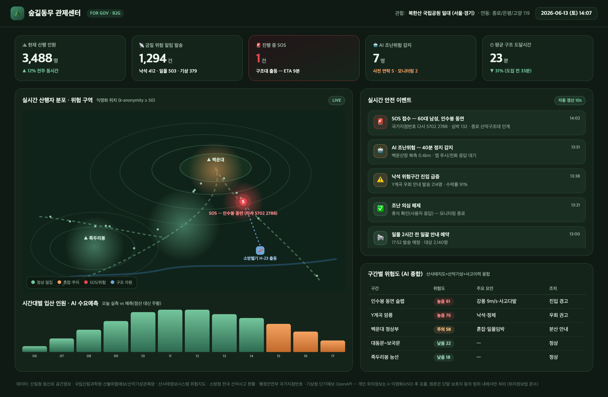

<p align="center">
  
</p>

# ForestMate

<p align="center">
  <a href="https://github.com/spcx0701/forest-mate/releases/latest"></a>
  <a href="https://github.com/spcx0701/forest-mate/actions/workflows/ci.yml"></a>
  <a href="https://www.codefactor.io/repository/github/spcx0701/forest-mate"></a>
  <a href="https://codecov.io/gh/spcx0701/forest-mate"></a>
  <a href="https://scorecard.dev/viewer/?uri=github.com/spcx0701/forest-mate"></a>
  <a href="https://www.bestpractices.dev/en/projects/13285"></a>
  <a href="https://sonarcloud.io/summary/overall?id=spcx0701_forest-mate&branch=main"></a>
  <a href="https://sonarcloud.io/summary/overall?id=spcx0701_forest-mate&branch=main"></a>
  <a href="https://sonarcloud.io/summary/overall?id=spcx0701_forest-mate&branch=main"></a>
  <a href="https://sonarcloud.io/summary/overall?id=spcx0701_forest-mate&branch=main"></a>
  
  <a href="LICENSE"></a>
  <a href="https://api.reuse.software/info/github.com/spcx0701/forest-mate"></a>
  <a href="https://forestmate.onrender.com/home.html"></a>
  
  
</p>

<p align="center">
  <strong>A hiking safety companion that uses forest public data and AI to predict risks before a hike and detect dangerous situations faster on the trail.</strong>
</p>

<p align="center">
  <a href="https://play.google.com/store/apps/details?id=kr.forestmate.app"></a>
  <a href="https://f-droid.org/packages/kr.forestmate.app/"></a>
  <a href="https://apps.obtainium.imranr.dev/redirect?r=obtainium://add/https://github.com/spcx0701/forest-mate"></a>
  <a href="https://github.com/spcx0701/forest-mate/releases/latest"></a>
</p>
<p align="center">
  <a href="README.md">Korean</a> &middot; <strong>English</strong>
</p>
<p align="center">
  <a href="https://forestmate.onrender.com/index.html"><strong>Web App</strong></a>
  &middot;
  <a href="https://forestmate.onrender.com/home.html"><strong>Service Intro</strong></a>
  &middot;
  <a href="https://forestmate.onrender.com/dashboard.html"><strong>Dashboard</strong></a>
  &middot;
  <a href="https://www.data.go.kr/tcs/puc/selectPublicUseCaseView.do?prcuseCaseSn=1077408"><strong>Public Data Use Case</strong></a>
  &middot;
  <a href="https://app.civictech.guide/p/forestmate/r/recQXWFIHBTDJLoZK"><strong>Civic Tech Guide</strong></a>
</p>

<p align="center">
  
</p>

ForestMate is a hiking safety service that connects **pre-hike route choice -> on-trail risk detection and SOS -> B2G monitoring** with forest public data and AI-assisted safety logic. In low-connectivity areas, it falls back to a local engine so the core safety experience keeps working.

The project ships a web app, an operations dashboard, and an Android APK. With the backend connected, `/api/v1` serves live public data and hiking records. In static hosting environments, the app falls back to local data and rule-based logic so the main screens remain usable.

> Submission package for the 2026 Forest Public Data and AI Startup Competition, Product and Service Development track. Listed as a [public-data use case on data.go.kr](https://www.data.go.kr/tcs/puc/selectPublicUseCaseView.do?prcuseCaseSn=1077408) and on [Civic Tech Guide](https://app.civictech.guide/p/forestmate/r/recQXWFIHBTDJLoZK).

## Key Features

- **Nationwide mountain catalog** - Search and bookmark roughly 4,600 mountain records from the Korea Forest Service, geocoded with VWorld and browsable by GPS location or 17 provincial regions.
- **Real-time hiking index** - Combines Korea Meteorological Administration short-term forecasts, the National Institute of Forest Science forest-fire danger forecast API, landslide risk, and sunset timing for mountain-specific risk scoring.
- **Real trail maps** - Displays Korea Forest Service trail geometry for roughly 2,200 mountains and 50,000 trail segments with difficulty-colored Leaflet routes and navigation links to trailheads.
- **GPS hike tracking** - Records real `watchPosition` movement, distance, and route instead of simulating progress. Prolonged immobility plus abnormal heart-rate signals can trigger automatic distress detection and notify guardians or emergency services.
- **AI companion** - Provides rule-engine and LLM/RAG intent responses, plus plant and mushroom identification demos.
- **Personalization** - Includes earned badges, a hike calendar, date-based suitability planning, location/favorite alerts, and Web Push notifications.
- **B2G monitoring dashboard** - Shows real-time KPIs, a WebSocket feed, and k-anonymized risk heatmaps for municipalities and emergency operators.

Android users can download the APK from GitHub Releases. The repository also includes source-build metadata for F-Droid submission. The current Android TWA opens the hosted `forestmate.onrender.com` service, so the F-Droid metadata declares the `NonFreeNet` Anti-Feature.

## B2G Monitoring Dashboard

ForestMate includes a real-time monitoring web dashboard for municipalities and fire/emergency agencies.

<p align="center">
  
</p>
<p align="center"><sub>Real-time KPIs, k-anonymized risk heatmap, and WebSocket live feed</sub></p>

## Tech Stack

<p align="center">
  
  
  
  
  
  
  
  
</p>

- **Backend** FastAPI, SQLAlchemy (SQLite/PostgreSQL), Pydantic, pytest, WebSocket
- **Frontend** PWA with service worker, offline support, Web Push, vanilla JS, and Leaflet maps
- **Data and AI** Korea public data APIs, Korea Forest Service data, VWorld geocoding, Claude LLM/RAG
- **Infrastructure** Docker, Render, GitHub Actions CI

## Architecture

```text
forest-mate/
|-- server/               # FastAPI backend
|   |-- main.py           #   app assembly + same-origin static frontend serving
|   |-- config.py         #   .env settings; falls back to snapshots/rules without keys
|   |-- db.py, models.py  #   SQLAlchemy with dev SQLite and prod PostgreSQL fallback
|   |-- adapters/         #   public-data adapters with TTL cache and fallback
|   |-- geo.py            #   KMA grid conversion + province coordinates
|   |-- data/             #   persistent catalog + trail geometry
|   |-- services/         #   scoring, safety, chat, llm, and monitoring bus
|   |-- routers/          #   public, hikes, and dashboard routes
|   `-- tests/            #   pytest coverage for scoring, safety, API E2E, WebSocket
|-- app/                  # static-capable client
|   |-- home.html         #   service intro landing page
|   |-- index.html        #   mobile PWA
|   |-- dashboard.html    #   B2G monitoring dashboard
|   |-- app.js            #   API client + fallback-aware app logic
|   `-- data.js, sw.js    #   local fallback data and offline service worker
|-- deploy                # Dockerfile, docker-compose.yml, render.yaml, .env.example
|-- packaging/            # Android TWA/APK and iOS Capacitor packaging
|-- deliverables/         # proposal DOCX and presentation PPTX
|-- legal/                # privacy policy and terms
`-- store/                # store listing metadata and submission runbook
```

## Running Locally

### Full stack: backend plus frontend, recommended

```bash
cd forest-mate
python3 -m venv .venv && .venv/bin/pip install --require-hashes -r requirements.lock
.venv/bin/uvicorn server.main:app --port 5181
```

- Landing page: http://localhost:5181/home.html
- App: http://localhost:5181/index.html
- Dashboard: http://localhost:5181/dashboard.html
- API docs: http://localhost:5181/docs

### Docker

```bash
cp .env.example .env
docker compose up
```

### Static-only mode

Host `app/` as static files to run with the local engine only. In this mode the LIVE badge is hidden and the dashboard uses simulation data.

## Operation Modes

| Feature | No keys, default | With keys |
|---------|------------------|-----------|
| Hiking index, weather, forest fire | Public-data **snapshots** with the live API schema | `DATA_GO_KR_KEY` enables **live public data APIs** |
| AI companion chat | **Rule-based intent engine** | `ANTHROPIC_API_KEY` enables **Claude RAG** with public-data context |
| Frontend | Local fallback engine | Backend detection enables **cloud mode** through the server |

LLM mode calls the Claude Messages API from `server/services/llm.py`. A fixed system prompt carries the knowledge base with prompt caching, while request-specific real-time context such as weather, course, and risk data is injected in the user message. The configured model is `claude-opus-4-8`.

## Core Domain Logic

- **Hiking index** in `services/scoring.py`: forest fire 0.3 + landslide 0.25 + weather 0.25 + sunset 0.2
- **Course recommendation** with explainable rules for fitness, knees, cardiovascular risk, crowding, and weather
- **Risk fusion** combining static risk such as landslide grades and accident history with real-time weather. Production can replace the rule fallback with XGBoost serving.
- **Distress detection** in `services/safety.py`: stopped movement for 30+ minutes raises level 1; abnormal heart-rate signals raise level 2 and trigger immediate propagation. Server-side judgment lets the last known data remain useful after app exit or network loss.
- **k-anonymization** so the dashboard shows clustered statistics instead of personal locations.

## Tests

```bash
.venv/bin/python -m pytest server/tests -q
```

The suite covers scoring, distress detection, k-anonymization, device registration -> hike -> risk warning -> SOS -> dashboard propagation E2E, and WebSocket reception. CI in `.github/workflows/ci.yml` runs pytest and a Docker build on every push and pull request.

## Data Sources

| Data | Provider | Usage in ForestMate | Source |
|------|----------|---------------------|--------|
| Nationwide mountain records | Korea Forest Service | Mountain catalog and search | [data.go.kr](https://www.data.go.kr/data/15029183/standard.do) |
| Trail spatial data | Korea Forest Service / Forest Big Data | Trail geometry and map points | [Forest Big Data Exchange](https://www.bigdata-forest.kr) |
| Short-term forecast | Korea Meteorological Administration | Hiking index, weather, schedule forecast | [data.go.kr](https://www.data.go.kr) |
| Forest-fire danger forecast | National Institute of Forest Science | Forest-fire risk level | [data.go.kr](https://www.data.go.kr) |
| Mountain weather observations | National Institute of Forest Science | Ridge weather alerts | [data.go.kr](https://www.data.go.kr) |
| Landslide information | Korea Forest Service | Landslide risk grade | [Landslide Information System](https://sansatai.forest.go.kr) |
| National species knowledge | Korea National Arboretum | Plant and mushroom identification | [nature.go.kr](http://www.nature.go.kr) |
| Forest welfare facilities | Korea Forest Welfare Institute | Healing forests and recreation forests | [Forest Trip](https://www.foresttrip.go.kr) |
| Mountain accident status | National Fire Agency | Risk section guidance | [data.go.kr](https://www.data.go.kr) |
| National point number | Ministry of the Interior and Safety | Standardized location coordinates | [data.go.kr](https://www.data.go.kr) |
| Address and coordinate conversion | MOLIT VWorld | Mountain coordinates and geocoding | [VWorld](https://www.vworld.kr) |
| Map tiles | OpenStreetMap | Map rendering | [OSM](https://www.openstreetmap.org/copyright) |

## License

Unless otherwise noted, the project code, documentation, Android resources, and project-owned image assets in this repository are distributed under the Apache License 2.0. See [LICENSE](LICENSE) and [NOTICE](NOTICE) for details.
